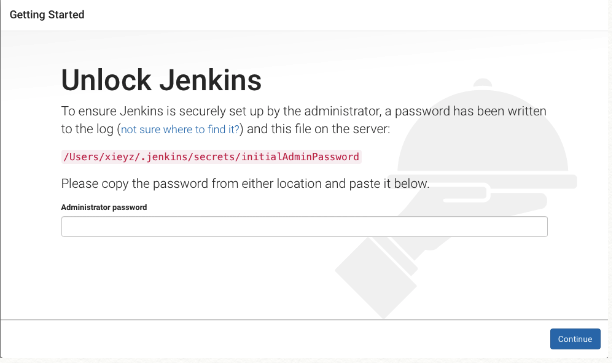
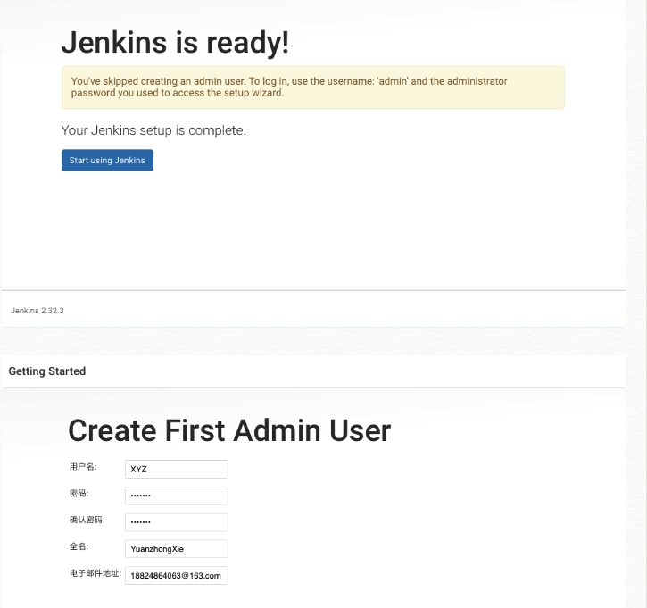

# Jenkins And Tomcat Setting On Your MacBook

1.[Java环境配置博文](http://www.jianshu.com/p/8cffd34d4d9a)

2.[配置Tomcat博文](http://blog.csdn.net/huyisu/article/details/38372663)

本地的Tomcat安装路径`/usr/local/apache-tomcat-9.0.0.M17`

终端输入`startup.sh` 进行启动Tomcat

正常打开Tomcat首页，说明Tomcat配置启动成功:

`http://localhost:8080/`

3.Jenkins部署到Tomcat

把`jenkins.war`直接拷贝到`tomcat/webapps`目录下就行了

启动之后访问地址是`http://localhost:8080/jenkins/`

4.我的本地Jenkins

我的Jenkins

`http://localhost:8080/jenkins/`

用户名：ablexie

密码：ablexie.github.io

全名：YuanzhongXie

终端开启我的Jenkins

`startup.sh`

终端关闭我的Jenkins

`shutdown.sh`



`/Users/xieyz/.jenkins/secrets/initialAdminPassword`

`cd0ff6693c4244118f6fb6499e7ee103`



用户名：admin

Password：ablexie

忘记管理员账号时，到`/Users/xieyz/.jenkins/config.xml`文件删除以下内容后，再重启Jenkins

```json
<useSecurity>true</useSecurity>

<authorizationStrategyclass="hudson.security.ProjectMatrixAuthorizationStrategy">

<permission>com.cloudbees.plugins.credentials.CredentialsProvider.View:dongjicheng</permission>

<permission>com.cloudbees.plugins.credentials.CredentialsProvider.View:huanghuaicheng</permission>

<permission>com.cloudbees.plugins.credentials.CredentialsProvider.View:limeng</permission>

<permission>com.cloudbees.plugins.credentials.CredentialsProvider.View:liuxianpeng</permission>

<permission>com.cloudbees.plugins.credentials.CredentialsProvider.View:shaoxiaogang</permission>

<permission>com.cloudbees.plugins.credentials.CredentialsProvider.View:tangyi</permission>

<permission>hudson.model.Hudson.Administer:admin</permission>

<permission>hudson.model.Hudson.Read:dongjicheng</permission>

<permission>hudson.model.Hudson.Read:huanghuaicheng</permission>

<permission>hudson.model.Hudson.Read:limeng</permission>

<permission>hudson.model.Hudson.Read:liuxianpeng</permission>

<permission>hudson.model.Hudson.Read:shaoxiaogang</permission>

<permission>hudson.model.Hudson.Read:tangyi</permission>

<permission>hudson.model.Item.Build:dongjicheng</permission>

<permission>hudson.model.Item.Build:huanghuaicheng</permission>

<permission>hudson.model.Item.Build:limeng</permission>

<permission>hudson.model.Item.Build:liuxianpeng</permission>

<permission>hudson.model.Item.Build:shaoxiaogang</permission>

<permission>hudson.model.Item.Build:tangyi</permission>

</authorizationStrategy>

<securityRealmclass="hudson.security.HudsonPrivateSecurityRealm">

<disableSignup>true</disableSignup>

<enableCaptcha>false</enableCaptcha>

</securityRealm>

```

这样就不需要login登陆，直接就可以进入jenkins界面了，就跟jenkins刚搭建好首次打开的状态一样。

可以进去在web界面上重置admin登陆密码。

也可以打开“允许用户注册”，接着另注册一个用户并授权为管理员（注册之前就授权为管理员），然后登陆后再重置之前的管理员密码。

最后再恢复config.xml文件（别忘了恢复这个文件），最后再重启jenkins即可！


[BackHome](http://robinshare.github.io/)