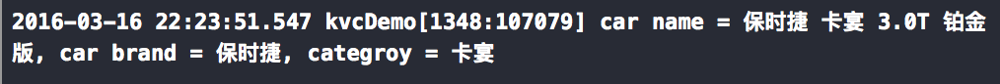

# KVC(Key-Value-Coding) 几行代码打造一个万能容器对象

#### 定义

KVC(Key-Value-Coding)意思是键值编码。在iOS中，提供了一种方法通过使用属性的名称（也就是Key）来间接访问对象的属性方法


用KVC实现一个万能容器对象的方法

终于到的正题，这里我们为了形象一些，拿车子来举例。下面的LXCar类没有任何属性但是理论上可以存任意数量的任意类型的属性。

LXCar.h文件内代码：

```objective-c
@interface LXCar : NSObject
// 父老乡亲们，看清楚，这容器就是空的！！！
@end
```

LXCar.m内代码：

```objective-c
@interface LXCar ()
// 用来放置属性键值对的字典
@property (nonatomic, strong) NSMutableDictionary *mPropertiesDict;
@end
@implementation LXCar
  // 没有对应key的setter方法且没有找到对应key的属性时调用
- (void)setValue:(id)value forUndefinedKey:(NSString *)key{    
  if (!key || [key isEqualToString:@""])
    return;    
  if (!_mPropertiesDict){
    _mPropertiesDict = [NSMutableDictionary dictionary];
	}
	[_mPropertiesDict setValue:value forKey:key];
}
// 没有对应key的getter方法且没有找到对应key的属性时调用
- (id)valueForUndefinedKey:(NSString *)key{    
  if (!key || [key isEqualToString:@""])
  	return nil;    
  return [_mPropertiesDict valueForKey:key];
}@end
```

然后执行代码：

```objective-c
LXCar *car = [[LXCar alloc] init];
[car setValue:@"保时捷 卡宴 3.0T 铂金版" forKey:@"name"];
[car setValue:@"保时捷" forKey:@"brand"];
[car setValue:@"卡宴" forKey:@"categroy"];

NSLog(@"car name = %@, car brand = %@, categroy = %@", [car valueForKey:@"name"], [car valueForKey:@"brand"], [car valueForKey:@"categroy"]);
```

下面是执行结果，你会发现原本空空的LXCar类被我们利用KVC特性打造成了万能的容器，可以放下原本没有的name/brand/categroy属性： 

其实相信都能看的懂上面的代码：利用接收对象既没有相应的setter/getter方法又无对象属性时调用`- (void)setValue:(id)value forUndefinedKey:(NSString *)key`以及`- (id)valueForUndefinedKey:(NSString *)key`两个方法的特性，给对象加入了一个可变字典作为填充属性的区域实现这样一个万能容器。

归纳kvc的优缺点

看了你可能已经爱上KVC了。但是请清醒一下，万物都有两面性，如果滥用KVC的话也不是什么好事：

KVC需要解析字符串来计算你所需要的答案，因此速度比较慢
编辑器无法对KVC进行错误检查，当你的key键输入错误时会引起运行时错误

写在最后

就像本文前面说的一样，这种万能容器对象可以用在后台接口平时还算规范但是偶尔会多返回一些出参的情况。所以不论是runtime还是KVC，是底层知识还是语言特性，一定要学以致用。毕竟空懂一腔理论知识却没有解决问题的能力学再多的东西也没有用……


[BackHome](http://ablexie.github.io/)