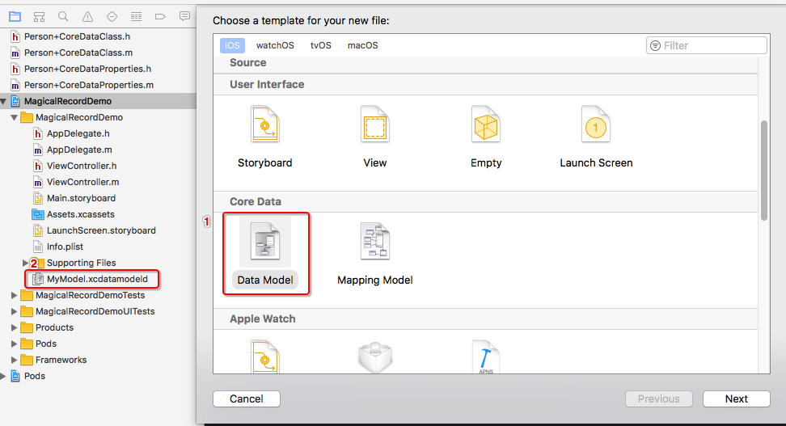
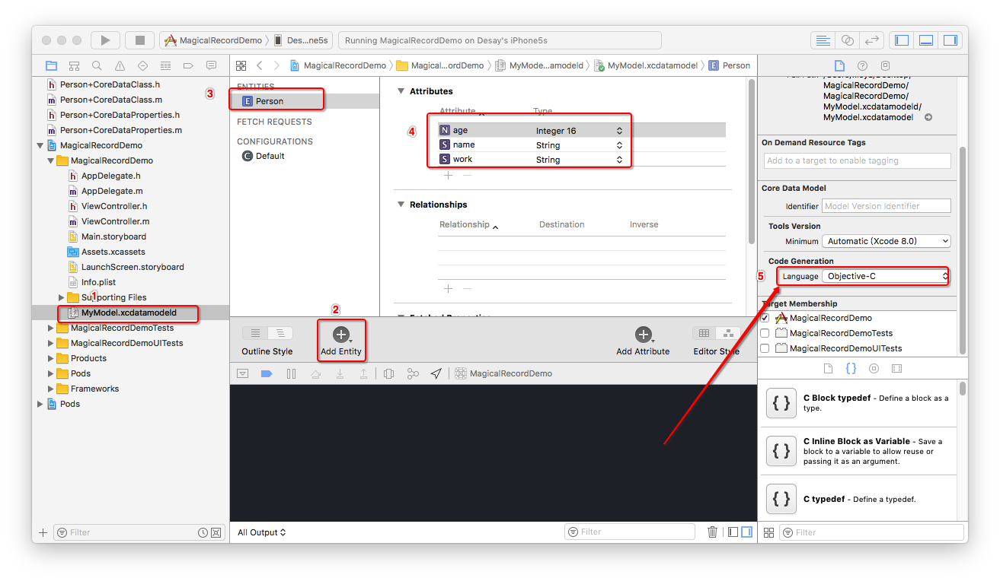
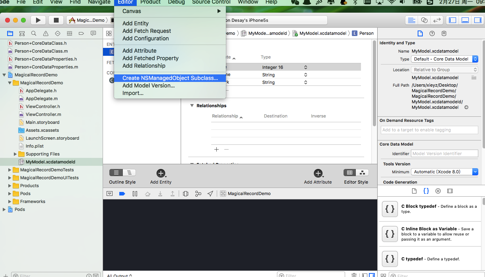
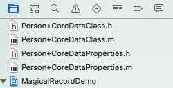

# iOS在Xcode8用MagicalRecord实现本地数据库

本篇记录的是关于在升级后的Xcode8以后，如何使用第三方库MagicalRecord实现本地数据库的初级篇。具体实现步骤如下：

1：下载好之后，创建好一个工程,不要勾选 CoreData,然后利用 cocoapods 下载安装好最新版本的 MagicalRecord

```markdown
platform:ios,'8.0'
target 'MagicalRecordDemo' do
pod 'MagicalRecord','~>2.3.2'
end
```


2： 为项目添加 CoreData.FrameWork。(点工程根节点，然后依次  Targets > Build Phases > Link Binary With Libraries > + > CoreData.framework > 添加 ),然后在文件需要使用到 MagicalRecord 库的地方: #import <MagicalRecord/MagicalRecord.h> 


3： 接下来，我们需要建立模型需要的模型， 做一个比方，这里建一个Person模型，属性有3个，name，age，work。然后进行相应的增删查改操作.

1、建立一个Data Model, 名字自取，我这里名字是 MyModel,然后 就会多了2这个文件。



2、建立模型Person,并添加属性。 首先选择TestModel ，然后点击坐下角的 Add Entity ,再修改名字成Person，再分别添加Person的三个属性，name , work ,age ，并给它们的type设置成string 、string 、integer 16,另外着重看第5点(箭头指向的地方) 这个是要设置成OC语言的，当然如果是swift语言就另说，这是和Xcode8之前的版本不同的地方.



3、 接下来是建模，建模也和之前的版本不同，不是之前的方法建模了，建模的地方放置到了这里：



4、点了一路的确定之后，将会出现这4个文件,然后我们在需要使用到Person模型的地方导入 #import "Person+CoreDataClass.h" .



5、这样做了之后，还有一个操作，就是在 AppDelegate.m 文件的 - (BOOL)application:(UIApplication*)application didFinishLaunchingWithOptions:(NSDictionary*)launchOptions 方法里面添加数据库存储的位置 建议添加以下全部代码，不然在控制台会有一些奇怪的输出。

```objective-c
- (BOOL)application:(UIApplication *)application didFinishLaunchingWithOptions:(NSDictionary *)launchOptions {
    // Override point for customization after application launch.
    [self dataBaseInit];
    return YES;
}

- (void)dataBaseInit{
    //初始化
    //数据库路径
    NSString *path = [NSHomeDirectory()stringByAppendingPathComponent:@"Documents"];
    path = [path stringByAppendingPathComponent:@"maDatabase.sqlite"];
    NSURL *url = [NSURL fileURLWithPath:path];
    //MagicalRecord 打印日志开启设置，警告和错误有提示语
    [MagicalRecord setLoggingLevel:MagicalRecordLoggingLevelWarn];
    //初始化MagicalRecord
    [MagicalRecord setupCoreDataStackWithStoreAtURL:url];
}
```

6、然后我们就可以开始对数据进行 增删查改 的四项操作了. 我简单实现了4个按钮，分别对应增删查改。其他的具体上代码。

```objective-c
- (void)viewDidLoad {
    [super viewDidLoad];
    // Do any additional setup after loading the view, typically from a nib.
    UIButton *add = [[UIButton alloc]initWithFrame:CGRectMake(20, 20, 60, 30)];
    add.backgroundColor = [UIColor redColor];
    [add setTitle:@"add" forState:UIControlStateNormal];
    [add addTarget:self action:@selector(add) forControlEvents:UIControlEventTouchUpInside];
    [self.view addSubview:add];
    
    UIButton *del = [[UIButton alloc]initWithFrame:CGRectMake(20, 80, 60, 30)];
    del.backgroundColor = [UIColor redColor];
    [del setTitle:@"del" forState:UIControlStateNormal];
    [del addTarget:self action:@selector(del) forControlEvents:UIControlEventTouchUpInside];
    [self.view addSubview:del];

    
    UIButton *mod = [[UIButton alloc]initWithFrame:CGRectMake(20, 140, 60, 30)];
    mod.backgroundColor = [UIColor redColor];
    [mod setTitle:@"mod" forState:UIControlStateNormal];
    [mod addTarget:self action:@selector(mod) forControlEvents:UIControlEventTouchUpInside];
    [self.view addSubview:mod];

    UIButton *fec = [[UIButton alloc]initWithFrame:CGRectMake(20, 200, 60, 30)];
    fec.backgroundColor = [UIColor redColor];
    [fec addTarget:self action:@selector(fec) forControlEvents:UIControlEventTouchUpInside];
    [fec setTitle:@"fec" forState:UIControlStateNormal];
    [self.view addSubview:fec];

}

- (void)add{
    NSArray *arr = @[@"学生",@"小孩",@"程序猿"];
    
    for (int i = 1; i < 10; i++) {
        //初始化
        Person *p1 = [Person MR_createEntity];
        p1.name = [NSString stringWithFormat:@"小明%d",i];
        p1.age = i + 10;
        p1.work = arr[arc4random()%3];
        
        NSLog(@"Person%d = %@",i,p1.work);
        
    }
    
    [[NSManagedObjectContext MR_defaultContext]MR_saveToPersistentStoreAndWait];
    
    
}

- (void)del{
    //先查询
    NSArray *all = [Person MR_findAll];
    
    for (Person *p in all) {
        //删除
        [p MR_deleteEntity];
        
    }
    //保存操作
    [[NSManagedObjectContext MR_defaultContext]MR_saveToPersistentStoreAndWait];
    
}

- (void)mod{
    //查找所有工作是学生的对象
    NSArray *workIsStudent = [Person MR_findByAttribute:@"work" withValue:@"学生"];
    
    //改年龄为6
    for ( Person *p in workIsStudent) {
        p.age = 6;
    }
    //保存修改
    [[NSManagedObjectContext MR_defaultContext]MR_saveToPersistentStoreAndWait];
    
    NSArray *ageIsSix = [Person MR_findByAttribute:@"age" withValue:@"6"];
    NSLog(@"查询年龄为6的人数量：%ld",ageIsSix.count);
    
}

- (void)fec{
    NSArray *all = [Person MR_findAll];
    NSLog(@"所有的模型的数量：%ld",all.count);
    
    NSArray *workIsStudent = [Person MR_findByAttribute:@"work" withValue:@"学生"];
    NSLog(@"关于工作是学生的数量：%ld",workIsStudent.count);
    
}
```


4: 稍稍总结了一下 ，用 MagicalRecord 来作为本地数据库存储是很方便，避免了写很多配置，只需要几行代码就能够完成项目的需求，另外标注一下，只有在读取数据的时候是不需要做保存操作的，其它的对数据库的操作是都需要在完成的时候，使用下面这行代码来进行保存。

```objective-c
[[NSManagedObjectContextMR_defaultContext]MR_saveToPersistentStoreAndWait]; 
```


5: 留下的坑 ：

 1、第一个建立模型的时候的，模型放置的位置在Xcode文件夹的最上面的那一块，取下来之后又会出现找不到文件的情况，有待解决.

2、如果直接从 Github 上取出来 MagicalRecord  那么会有文件找不到的报错，不知道如何解决。


[BackHome](http://robinshare.github.io/)


