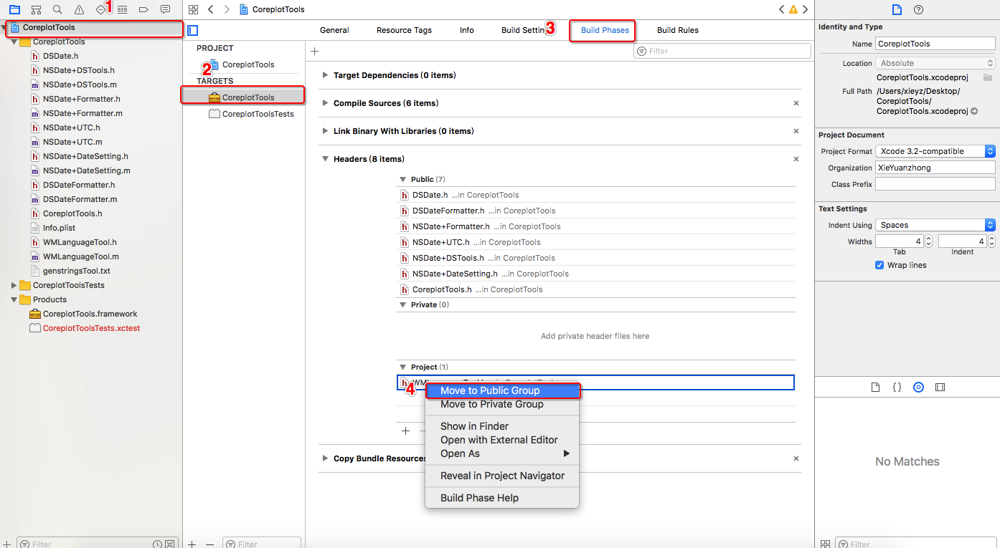
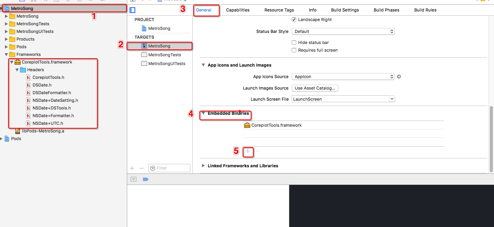

# iOS开发自定义framework

#### iOS开发之制作framework

##### 什么是framework

```markdown
Framework是资源的集合，将静态库（iOS8以后可以是动态库）和其头文件包含到一个结构中，让Xcode可以方便地把它纳入到你的项目中。
分为真机—Debug（调试）版本、真机—Release（发布）版本、模拟器—Debug版本、模拟器—Release版本；开发中一般都打包Release（发布）版本，将真机和模拟器版本合并，提供外界。
在项目开发的过程中，例如两个公司之间业务交流，不可能把源代码都发送给另一个公司，这时候将私密内容打包成framework，别人只能调用接口，而不能知道其中实现的细节。
framework对CPU架构的支持，首先了解iOS设备CPU架构方面的知识，ARM是微处理器行业的一家知名企业，arm处理器以体积小和高性能的优势在嵌入式设备中广泛使用，几乎所有手机都是使用它的。
模拟器：iphone4s-5 : i386 ， iphone5s-6plus : x86_64。
真机：iphone3gs-4s : armv7 ， iphone5-5c : armv7s （静态库只要支持了armv7，就可以跑在armv7s的架构上）， iphone5s-6plus : arm64。
armv6, armv7, armv7s是ARM CPU的不同指令集，原则是向下兼容的。例如iPhone4S CPU支持armv7, 但它同时兼容armv6，只是使用armv6指令可能无法充分发挥它的特性。
```

##### 怎么制作framework

```markdown
1、打开Xcode创建一个framework工程。

2、修改一些配置信息，生成支持所有架构的版本。
选择PROJECT->TARGETS->Build Settings->Build Active Architecture Only中，把Debug和Release都设值为No

3、将之前写好的控件源文件拖进工程，并做一些配置，主要是配置一下那些文件要暴露给别人使用，一般头文件需要暴露，实现文件不需要。
选择PROJECT->TARGETS->Build Phases->Headers展开，在其下的Project右击需要暴露的头文件，然后Move to Public Group

4、编译，要分别针对模拟器和真机进行编译。

5、编译成功就会在工程的Products组下有一个黑色的xxxxx.framework的文件，如果编译失败是红色的，红色表示没有生成。右击xxxxx.framework的文件，然后Show in Finder，可见真机编译出来的Debug-iphoneos和模拟器编译出来的Debug-iphonesimulator

6、制作通用的framework，以上几步分别生成真机和模拟器的framework，接下来生成一个通用的。
a.使用lipo -info ./XXX 查看真机版支持的架构
XieYZdeMacBook-Air:Debug-iphoneos xieyz$ lipo -info ./CoreplotTools.framework/CoreplotTools 
Architectures in the fat file: ./CoreplotTools.framework/CoreplotTools are: armv7 arm64 
XieYZdeMacBook-Air:Debug-iphoneos xieyz$

b.使用lipo -info ./XXX 查看模拟器版支持的架构
XieYZdeMacBook-Air:Debug-iphonesimulator xieyz$ lipo -info CoreplotTools.framework/CoreplotTools 
Architectures in the fat file: CoreplotTools.framework/CoreplotTools are: i386 x86_64 

c.使用lipo -create ./XXX ./XXX -output ./XXX 合并真机版和模拟器版的framework，生成新的framework
XieYZdeMacBook-Air:Products xieyz$ lipo -create ./Debug-iphoneos/CoreplotTools.framework/CoreplotTools  ./Debug-iphonesimulator/CoreplotTools.framework/CoreplotTools -output ./CoreplotTools
XieYZdeMacBook-Air:Products xieyz$

d.使用cp ./XXXA ./XXXB 将新的名为XXXA的framework 替换 原来名为XXXB的framework，并查看合并后framework支持的架构
XieYZdeMacBook-Air:Products xieyz$ cp ./CoreplotTools ./Debug-iphoneos/CoreplotTools.framework/
XieYZdeMacBook-Air:Products xieyz$ lipo -info Debug-iphoneos/CoreplotTools.framework/CoreplotTools 
Architectures in the fat file: Debug-iphoneos/CoreplotTools.framework/CoreplotTools are: i386 x86_64 armv7 arm64 
```



##### 怎么使用framework

```
1、将XXXX.framework拖进工程，然后配置加载信息。
选择PROJECT->TARGETS->General->Embedded Binaries展开，将XXXX.framework添加+

2、使用#import <XXXX/XX.h>例如，#import <CoreplotTools/DSDate.h>引用相应暴露的头文件，便可调用相应的API

```




现在可以开心的耍起来了！


[BackHome](http://robinshare.github.io/)