# 如何自行注册美国商标

商标注册的流程分为9个部分，今天我们所讲的是第四部分。

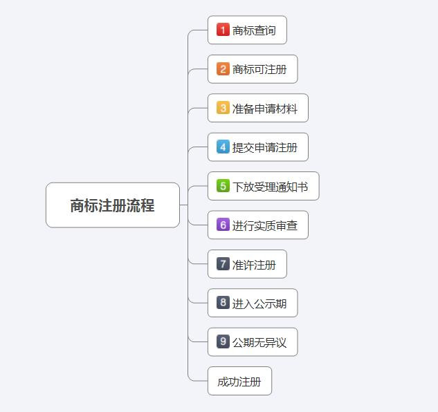

1.打开以下链接：https://www.uspto.gov/

2.点击申请注册，如下图

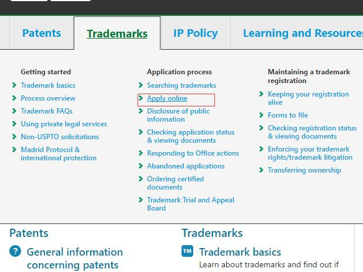

然后你就会看到这三个表格了？这三个表格的费用为什么相差这么多，有什么差别呢？（PS现在的价格也涨价了， 我的荷包啊啊啊）看万事屋老板娘的解答

(→_→) 大致区别如下：

1. 费用分别为225USD，275USD，400USD
2. 通过TEAS Plus, TEAS RF 在提交申请时附上一个可收取文件的邮箱，供USPTO发送商标的后续文件，TEAS Regular不需要
3. TEAS Plus, TEAS RF提交后续相关程序时需要通过TEAS
4. 通过TEAS Plus在提交申请时，商品及/或服务描述必须根据USPTO提供的商品/服务列表选择；而另外两个不需要，申请人可以根据自己的具体商品/服务进行描述，但需要尽可能地详细准确，避免后期审查意见
5. 通过TEAS Plus在提交申请时就必须付清所有类别的费用
6. 通过TEAS Plus在提交申请时必须提供有关的商标描述（如翻译，颜色声明等），另外两个方式不作要求；
7. 如果在提交申请时未满足相关的要求，TEAS Plus, TEAS RF后期可能产生50美元/类的费用，TEAS Regular不需要

作者：万事屋老板娘

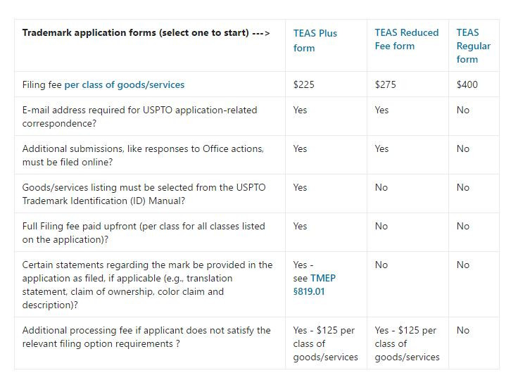

3.选择你所需要的点击进入填表，这里我就选择最便宜的一档吧

这里直接选NO，应该你不是代理~~~，然后continue

红色*的都需要填上，必须的。邮件地址记得要写，用来接收邮件啥的。填完就continue

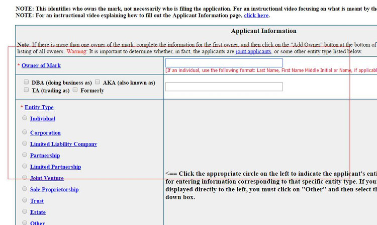

 这个部分就是要填有关于商标的信息了

这里有三种类型的：1是普通标准（文字）2是文字跟图案的商标一起的 3声音商标~~~

选1的就直接在空白框填上你的商标文字就可以了，例如beanbing之类的，右下角的要打勾

选2的如下图所示

选3的跟1的差不多

填完就continue~~~

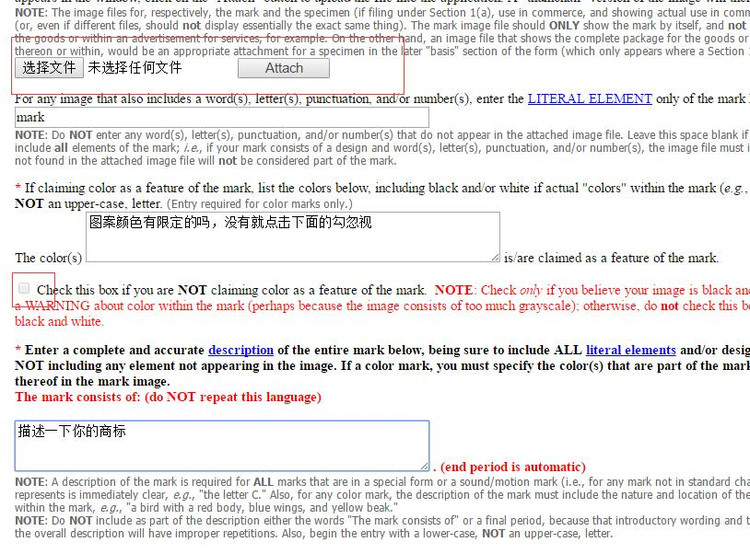

当然如果我们不将右下角的打勾的话，就会出现下列的一大堆要填，当然了，你现在不填，往后人家可能也会发过来让你填的~~·

`所圈的红框处的意思是之前是否以同样的名义，提交过与此次所申请的商标相同或者近似度较高的商标，并且该之前申请的商标已成功注册。如果有的话，就填入商标的注册号。（万事屋老板娘所答）`

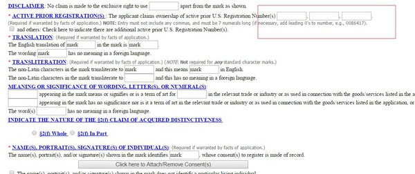

然后就是为你的商标找一个类目了，注意要看清楚，注册错白花花银子可是要不回来的。

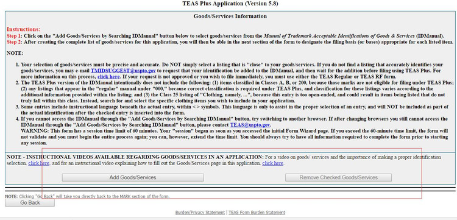

在这里有很多的大类（如户外一个类目，家居为一个类目，家居里面还有无数多的小类目，每个大类只能选20个，超过的要收钱，这次不选的话，下次要想新的小类目的话，就相当重新申请一个商标那么贵了~~~）

那这里的类目要怎么选，根据[WTO](http://www.wipo.int/)的尼斯分类（商标分类），可以在这里进行查阅，http://www.wipo.int/classifications/nice/zh/  然后按照名字或者编码去UPSTO上找。

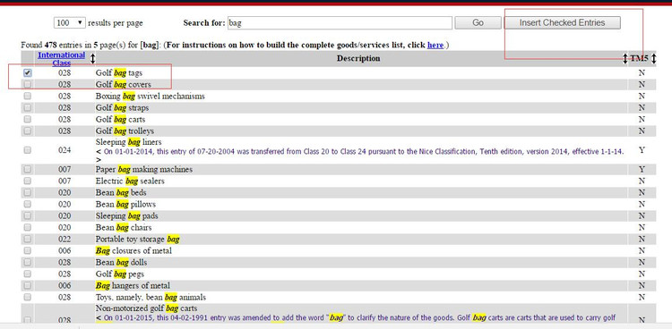

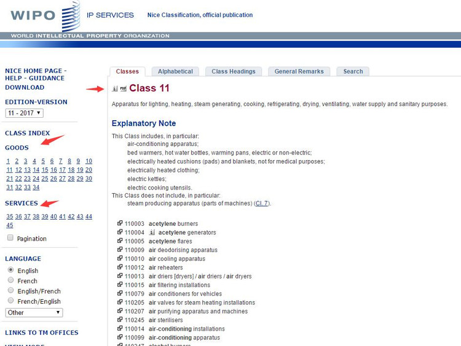

以下四选一填表格，我的时间写错，自动忽视，填完之后点击assigned  filming basis.

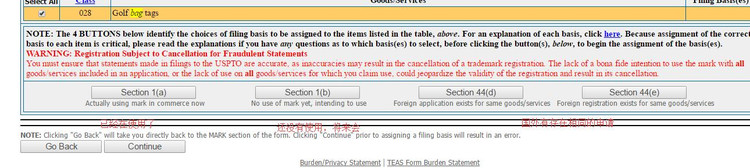

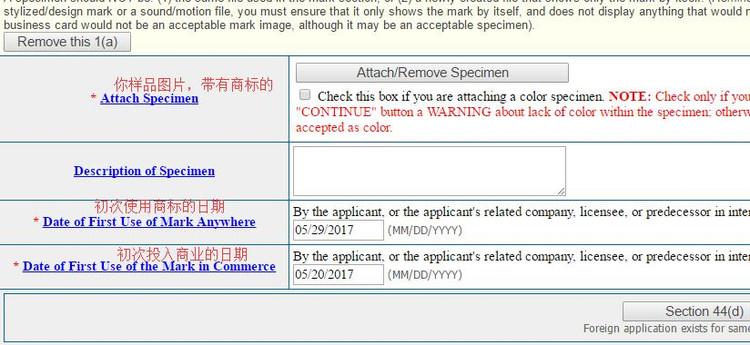

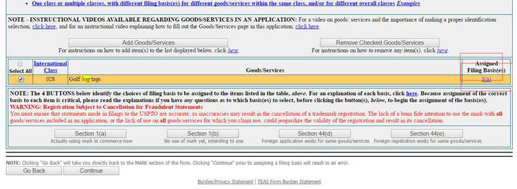

下面的就是确认以下资料是否无误~

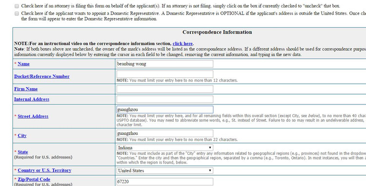

再然后就是这个啦

有三种不同的签名方式，简单点的就第一种，电子签名

1.签名名字的格式应当为 /名字/

2.所有的框框都要打勾，意味着你已经阅读过相关的资料，确保资料巴拉巴拉巴拉巴拉

continue~~~~

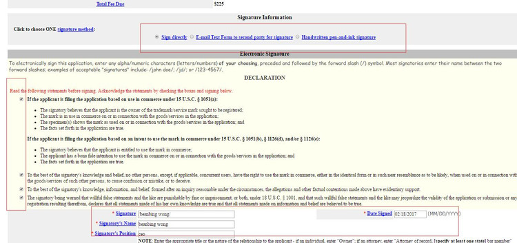

绿色栏那里你可以看到相关申请文件，最后一次机会去确认是否资料填对，下面的邮箱确认多一次，然后打勾，然后pay

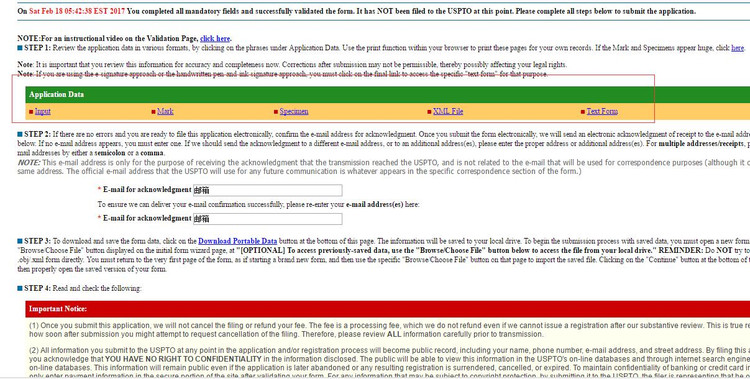

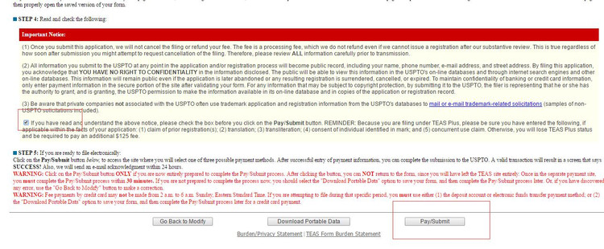

付款支持信用卡PayPal等等

这里选择游客登录模式就可以了。后续的给钱模式了

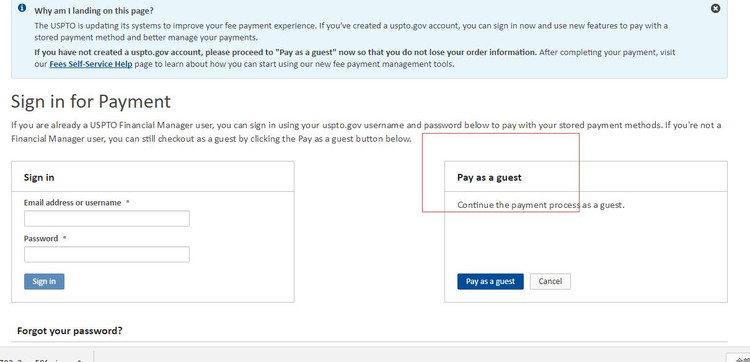

 [全球品牌数据库](http://www.wipo.int/reference/zh/branddb/)

以上如有不对地方，请指出，如有错误，请见谅，但一定要提出啊~~~

这些注册商标的第一步，后续工作人员会发邮件给你确认，要求你补交资料这些的，（一般都是销售证明的资料，例如电商网店，发票这些）切记一定要及时提交，要不然误了可就不好了。

当然嫌麻烦的，可以去找代理的，价格一般都是在3000大洋到5000大洋（我所接触的就是这个价格的）

代理也要找好的，靠谱的，因为人家的专业知识比你强。

