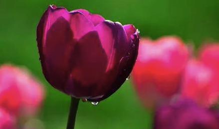
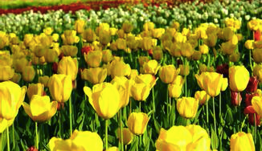
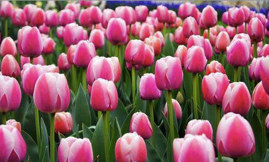
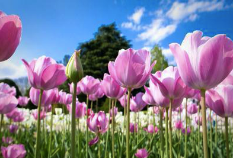
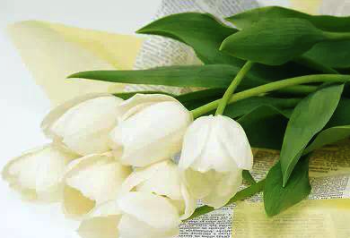

# 郁金香的花语

       俗话说：“生容易，活容易，生活不容易。”此刻，再真切不过了，尤其是随着毕业尾音的靠近。如果一个人只是在混日子就可以说过得很舒服、很自在、很有意义，那该多好啊，因为这样就不用再为人生的价值、意义……而深思、烦恼、抓狂……说得可笑一些，有时候被生活逼得不知所措时，甚至会对街边的傻子产生一种深深地羡慕——反问如果那个蹲着街头的人是现在的自己会不会就没有眼前的烦恼和痛苦？当然，这仅仅是“如果”，我无从得知事实的答案。

       其实，认真思考一些烦恼的事情时，没什么可以一直困扰着一个人，因为时间总会在某个点给出解决的办法，这也是我选择自己的座右铭是“顺其自然，尽心尽力”的原因。因此，我相信任何问题都是有解决的方法的，只是不知我们能否等到方法出现的时间点上罢了。朋友，在生命里的重要性仅次于亲人和梦想之后，这一直引导我去结识一群生命里的有缘人，不关性别肤色，无论年龄大小。

       “千里迢迢是朋友，朋友多路好走……”这也是至少目前不变的事实，更由于人类之前的猿人原本就是群居的动物。当然，也不是朋友越多越好，而是有选择性的。

       那么，生活中的我们该如何去选择朋友呢？这是一个没有答案的问题。每个人有属于自己的看法——还是不稳定的看法，一种随着时间积累在不断完备的看法。所以，对于一个才二十来岁的年青小伙而言，更是需待时间来去得出那个自己的答案。如今，也不过是暂时的，但跟大家分享也无妨。

       首先，朋友是干什么用的？朋友，是在你快乐时可以和你一起欢笑的人，也可以是有共同追求的一些人，更可以是在平淡生活中送来远方问候的人……朋友不必天天见，但有一点就是会偶尔时常想起对方，猜测对方在干什么，最近日子过得还好不……在你需要帮助时，朋友会尽其最大的努力给你出谋划策，给你鼓励和信心，这就是我想要的朋友。朋友，你不需要有多么的富裕，你不需要有多么的高雅，你可以是那么的市井，你也可以是那么的底层，你更可以在物质上什么都没有，但是，朋友必须真诚。所以，不是所有你认识的人都叫“朋友”，不管你是否认同，但我是这么认为的。

       在以后的职场上，可能我会认识很多新人，但他们一开始不叫“朋友”而是“同事”；在经商的场子里，跟我谈生意的人会有很多，但他们一开始也不叫“朋友”而是找另外一个词替代“生意人”或又是“客户”；在生活的圈子里，身边不免会结识一些素未谋面的人，但他们一开始更不叫“朋友”而是“陌生人”。朋友，是需要时间相互选择的，所以现在的朋友是来之不易的。正因为这个，我们才欢呼友谊万岁！

       谈到这里，我或是词穷或是不想说一些不确定的事，只好峰回路转地回归生活。至于为什么叹息“生活不容易”，估计身边的很多人都比我明白、比我懂。坎坎坷坷地走过二十多年，最美好的唯数天真无邪的童年了吧！？很多的人与事都被时间冲淡了，从而使得回忆起来更加有滋有味。经历了从不懂事到长大的过程，曾经的憧憬依旧很美的留在脑海，只是现实告诉你那些仅仅是幻境，你再努力也还是继续憧憬。

       这算是很温柔的了，因为它没有迫使你为它放弃一切自己想去追求的东西，包括梦想。我不敢想象，世界上究竟有多少人迫于生活而放弃了自己最初的梦想，然后，走在一条现实安排的路上，踏上一个造就另一个成功自己的舞台。所以，很多成功人士在飞黄腾达以后才去完成自己最初的梦想，前提是这个最初的梦想得跟追梦者的年龄无关。更有甚者，有那么一部分人在被迫抛弃初衷后再也没机会重拾初梦，平庸地紧凑地过完属于自己那两、三万天的生活。所以，生活很多时候是残忍的。

       定义生活的好坏跟每个人的追求有关系。可能你认为很糟糕的生活，在别人眼里正是他想要的生活。例如，一方追求自由，另一方追求富裕。正所谓如此，有些穷人过得很快乐而富人并不快乐。想要让自己的生活过得好，首先得知道自己的追求是什么，通俗点就是“爱什么”。面对生活的不容易，我们每个人绝对都是无力反抗的，因为人生离不开“生活”二字。可以说，热爱生活以及敬畏生活是人生中必修的课程。

       成功、梦想和生活三者没有必然的关系。因为成功的人不都是奔着最初的梦想去得来今天的，因为梦想可能被生活蹂躏得无地自容。但是，它们三者可以拼凑出一个叫“人生”的旅途。在这趟旅途中，除了亲人外，最重要的角色那就是朋友了。所以，感谢你们走进我的生命里，陪我走过一个个春夏秋冬，当然，得特别感谢以后的一位最特别的朋友——相敬如宾的伴侣。

       最后，送上每一朵我最喜爱的郁金香，愿每位朋友有个快乐的旅途，愿生活变得美好。

                           

 笔名:心扉旅途

 2014年10月31日星期五  天气晴多云 

[BackHome](http://robinshare.github.io/)