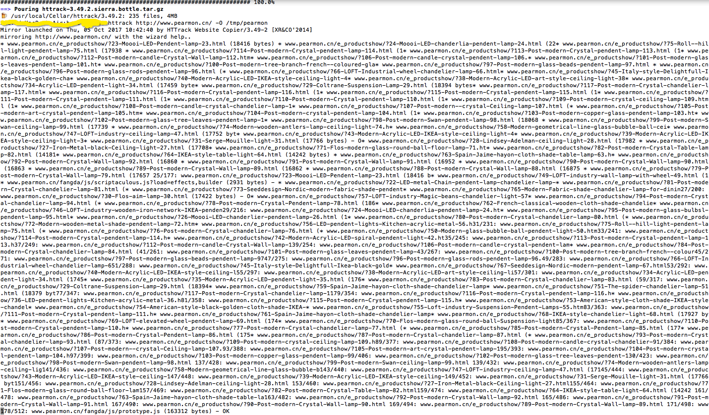
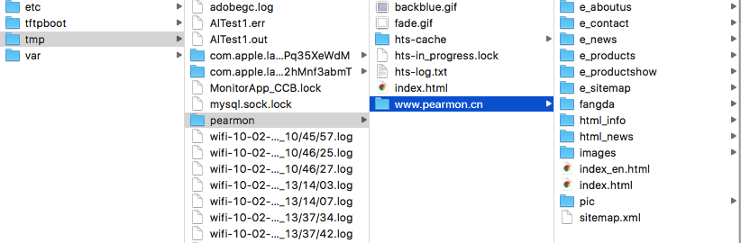

# 克隆任意网站--HTTrack

[HTTrack官网](http://www.httrack.com/page/2/en/index.html)

首先简单介绍今天的克隆神器——HTTrack，其可以克隆指定网站——把整个网站下载到本地，以致可以用在离线浏览上，也可以用在收集信息（甚至有网站使用隐藏的密码文件）。某些仿真度极高的伪网站（为骗取用户密码），也是使用类似工具做的。当然，如果你想使用某个网站模板，也可以下载到本地再做修改。

这里简单介绍macOS中的安装和使用，其他系统的可以参照官网。

打开终端，输入以下命令安装：

```
brew install httrack
```

现在克隆http://www.pearmon.cn/网站到本地文件夹/tmp/pearmon路径，在终端中执行以下命令：

```
httrack http://www.pearmon.cn/ -O /tmp/pearmon
```



可以前往文件夹/tmp/pearmon路径查看，如下：



Okay，大公开始了，耐心等！


[BackHome](http://robinshare.github.io/)